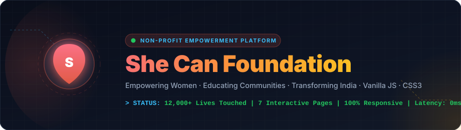
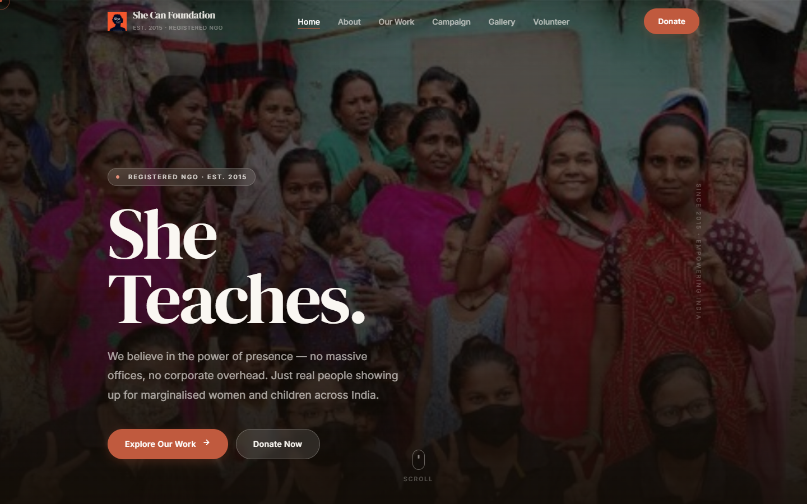
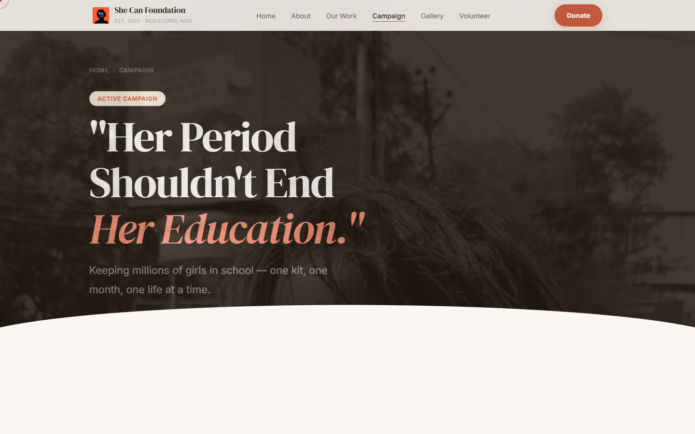
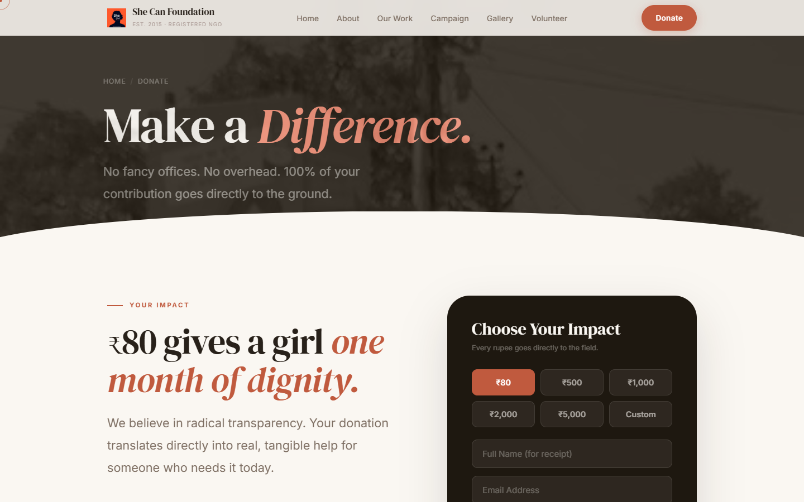
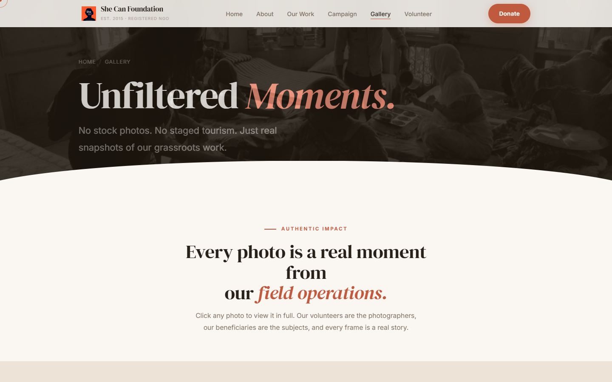

<div align="center">

[](https://shecanfnd.netlify.app/)

<br/>

[](https://shecanfnd.netlify.app/)
[]()
[]()

</div>

---

## 🔗 Live Website Demo

🌐 **Experience the live, interactive web application:**  
👉 **[https://shecanfnd.netlify.app/](https://shecanfnd.netlify.app/)**

---

## ✨ Key Architectural Highlights & Features

The **She Can Foundation** website is a next-generation, highly technical, and visually stunning web platform designed to elevate non-profit digital experiences. It breaks away from generic NGO templates by introducing **premium aesthetics, dynamic micro-interactions, and state-of-the-art visual engineering**.

### 🚀 Featured Technical & Design Highlights

*   **🎬 Animated Banner & Hero Architecture**  
    The landing experience greets users with a dynamic, immersive hero section featuring staggered entrance animations (`data-anim="up"` / `fade`), parallax scroll tracking, and a floating interactive scroll wheel indicator.
*   **🎨 Custom Modern Glassmorphic Hero Banner**  
    A fusion of human-centric storytelling and modern, cutting-edge design philosophy. The hero blends high-contrast silhouettes, rich photography, and warm architectural lighting with dynamic typography to instantly captivate visitors.
*   **✨ Animated Typing Effect**  
    Powered by custom Vanilla JavaScript (`#typedText`), the hero headline dynamically cycles through powerful action verbs (`Teaches.`, `Heals.`, `Unites.`, `Rises.`, `Can.`) with realistic human typing pauses, backspacing intervals, and cursor blinking.
*   **🌌 Glassmorphism Design System**  
    Extensive use of modern frosted-glass UI (`backdrop-filter: blur(20px) saturate(1.5)`). As the user scrolls past the hero banner, the sticky header transforms seamlessly from crystal transparent to a translucent, frosted glass surface (`rgba(250, 247, 242, 0.88)`) with subtle drop shadows and crisp borders.
*   **⚡ Animated SVG Section Dividers & Micro-Interactions**  
    Clean, fluid section transitions between light (`--cream`), warm (`--sand`), and dark (`--bark`) sections. Includes custom animated SVG icons, rotating FAQ accordion arrows (`rotate(45deg)`), expanding stat progress bars, and directional view triggers.
*   **🎭 Curated High-Contrast Modern Color Palette**  
    A meticulously curated, high-contrast HSL/RGB color token system designed to convey hope, dignity, and premium technology:
    *   `--clay` / `--clay-dark` (`#E05A47`): Vibrant, energetic terracotta highlight.
    *   `--bark` / `--bark-mid` (`#1E1810`): Sleek, deep organic dark mode contrast.
    *   `--cream` / `--cream-warm` (`#FDFBF7`): Soft, natural readability backgrounds.
    *   `--sand` & `--sage` (`#DDE8E3`): Calming, balanced structural tones.

---

## 📸 Visual Showcase & Screen Captures

Here are actual screen captures and visual sections featured across the She Can Foundation platform:

### 🏠 Home Page & Animated Hero Banner


### 📚 Period Power & Educational Campaigns


### ❤️ Impact & Donation Tiers


### 🖼️ Real Field Operations Gallery


---

## 🛠️ Deep-Dive Technical Architecture

### 1. Centralized Component Auto-Injection (`script.js`)
To maintain clean, DRY (`Don't Repeat Yourself`) HTML across 7 independent pages without requiring a backend Node server or build step, `script.js` acts as a client-side layout engine:
*   **Dynamic Navigation & Footer:** Automatically injects `NAV_HTML` and `FOOTER_HTML` into every page's DOM upon execution.
*   **Contextual Active State Detection:** Reads `location.pathname`, matches `data-p` attributes, and highlights the active navigation item dynamically (`is-active`).
*   **Header Theme Adaptation:** Detects the presence of `.hero` and adjusts navbar transparency (`transparent` vs `frosted`) based on real-time scroll position (`window.scrollY > 80`).

### 2. Advanced Interactive Physics & Motion
*   **Magnetic Card 3D Tilt:** Moving the mouse across program cards (`.card`) and volunteer cards (`.vol-card`) computes relative bounding coordinates (`getBoundingClientRect`) and applies real-time 3D rotation (`rotateX`, `rotateY`) with `perspective: 800px`.
*   **Custom Dual-Ring Cursor:** A custom trailing dot (`#cursorDot`) and spring-physics outer ring (`#cursorRing`) that smoothly glide across the viewport, expanding when hovering over interactive elements or text inputs (`body.cursor-hover`, `body.cursor-text`). Automatically disabled on touch screens.
*   **Drag-to-Scroll Tracks (`.hz-track`):** Native mouse-drag (`mousedown`, `mousemove`, `mouseup`) physics allow desktop users to click and drag horizontally across program cards with `scroll-snap-type: x mandatory`.
*   **Non-Linear EaseOutExpo Counters:** Intersection-observed statistics (`12,000+`, `500+`, `3,000+`, `200+`) animate smoothly from zero to their target count using mathematical `easeOutExpo` interpolation when scrolling into view.

### 3. Comprehensive Multi-Page Structure
| Page | File | Purpose & Layout Features |
| :--- | :--- | :--- |
| **Home** | `index.html` | Hero typing banner, What We Do program cards, Period Power campaign split, interactive Photo Mosaic (`.photo-mosaic`), and live statistics strip. |
| **About Us** | `about.html` | Mission statement, founding story, core values (`.vals-grid`), and organizational transparency metrics. |
| **Our Work** | `work.html` | Detailed program breakdown (`EduShe`, `Community Circles`, `Food & Care`, `SkillUp She`) formatted in alternating high-impact panels (`.work-panel.flip`). |
| **Campaign** | `campaign.html` | Dedicated landing page for the **Period Power** initiative, complete with editorial typography, problem/solution breakdown, and direct donation hooks. |
| **Gallery** | `gallery.html` | High-resolution masonry photo grid (`.gallery-masonry`) featuring 100% authentic field photography with click-to-zoom Lightbox (`#lightbox`). |
| **Volunteer** | `volunteer.html` | Role selection (`On-Ground`, `Mentor/Teach`, `Spread Awareness`), detailed FAQ accordion, and real-time application form (`#joinForm`). |
| **Donate** | `donate.html` | Impact tier breakdown (`₹80`, `₹500`, `₹2,000`, `₹10,000`), trust badges (80G Tax Exemption, NGO Darpan Certified), sticky donation card (`.donate-card-wrap`), interactive amount selector, and instant feedback success state (`#donateSuccess`). |

---

## 💻 Running the Application Locally

Because the project uses modern, pure browser-native standards (HTML5, CSS3, ES6+ JavaScript), zero external dependencies or package installations (`npm`/`yarn`) are necessary.

1.  **Clone or Download the Repository:**
    ```bash
    git clone https://github.com/keshavmandaar/She-Can-Foundation.git
    cd She-Can-Foundation
    ```
2.  **Launch Directly:**
    Double-click `index.html` to open it in any modern browser (Google Chrome, Mozilla Firefox, Safari, Microsoft Edge).
3.  **Optional Development Server:**
    For the smoothest experience when testing JavaScript DOM injection and responsive breakpoints, launch via VS Code's **Live Server** extension or Python's built-in HTTP server:
    ```bash
    python -m http.server 8000
    # Then visit http://localhost:8000 in your browser
    ```

---

<div align="center">
  <p><strong>© 2024 She Can Foundation. All rights reserved.</strong></p>
  <p><em>Made with care, for every woman who dares to dream.</em></p>
</div>
